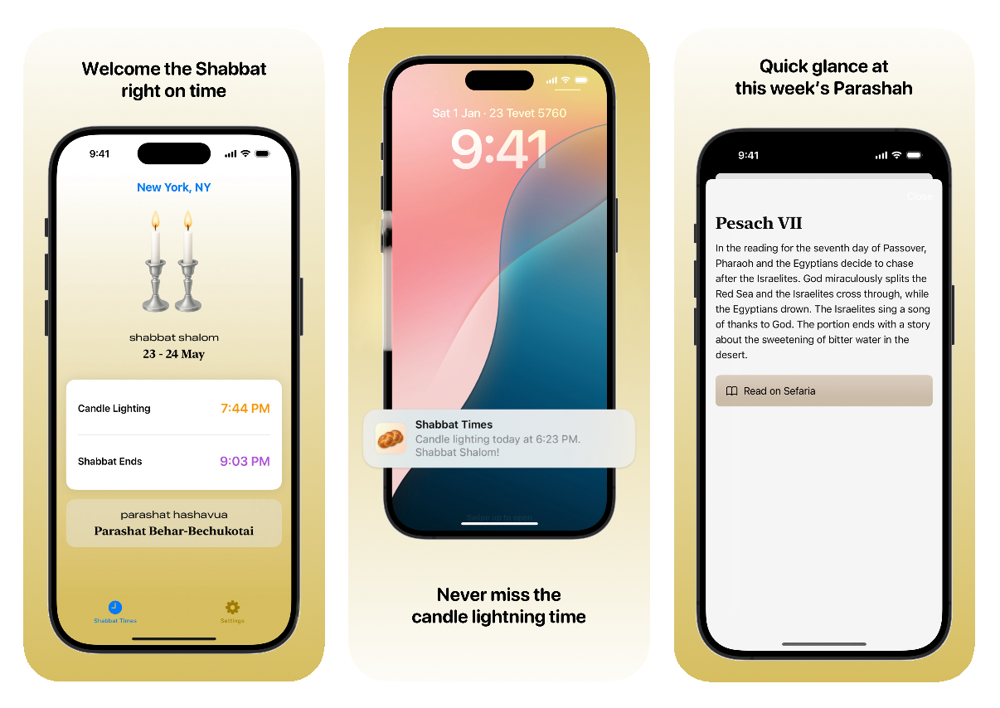

# Shabbat Times

Shabbat Times is an iOS app that displays this week's Shabbat times. Built with SwiftUI and uses the [HebCal API](https://www.hebcal.com/home/197/shabbat-times-rest-api) & [Sefaria API](https://developers.sefaria.org/reference/getting-started).

Available on the App Store: [Shabbat Times](https://apps.apple.com/app/shabbat-candle-times/id6741048381)

## Contributing

Contributions are welcome. Just fork this repo and create a PR. It's always better to discuss major changes in an issue first.

## License

The source code is released under the AGPL-3.0 license.
The project assets - the user interface, app branding, images, illustrations and icons are outside the scope of the license.
